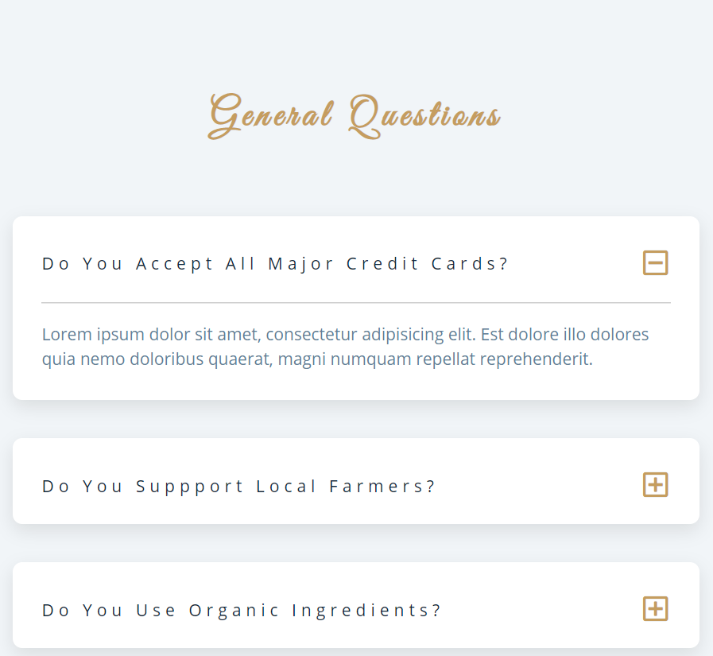

# Questions

[Click to see](https://ayerdelen.github.io/basic-projects/Questions)

- This is a tutorial of [Free Code Camp](https://www.youtube.com/watch?v=3PHXvlpOkf4&list=WL&index=21&t=21s)

## I've learned:
-Selecting multiple querySelector into the elements,
-toggle classList,
-Open one section and closing the other ones.

