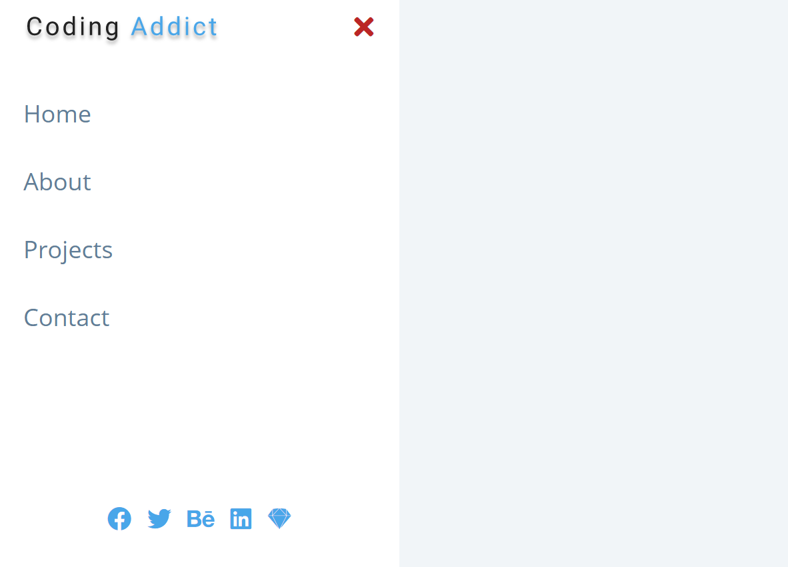

# sidebar

[Click to see](https://ayerdelen.github.io/basic-projects/sidebar)

- This is a tutorial of [Free Code Camp](https://www.youtube.com/watch?v=3PHXvlpOkf4&list=WL&index=21&t=21s)

## I've learned:
-Toggle sidebar menu without using Bootstrap
-add, remove and toggle differences.
-close button logic

